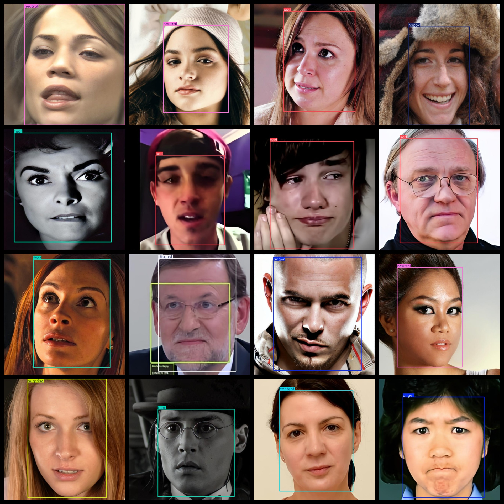
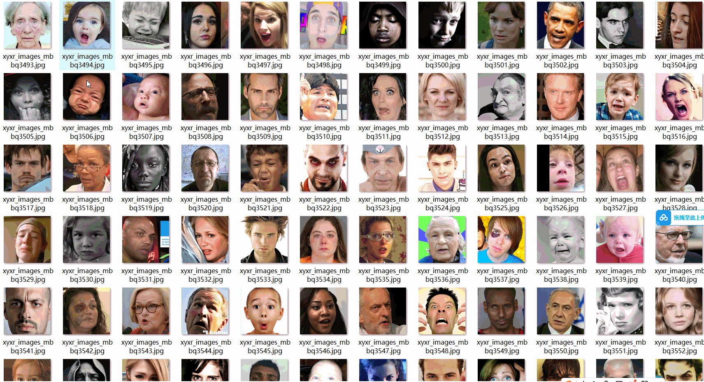

# [Object Detection] 8 typesPerson Type Surface Part Expression Data 9400 imagesYOLO+VOC format

【Object Detection】8 types of human facial expression data 9400 images in YOLO+VOC format

Dataset Format: VOC format + YOLO format

The compressed file contains: three folders, each storing images, xml files, and text files.

Total jpg images in JPEGImages folder: 9400

The XML files in the Annotations folder total: 9400.

The total number of txt files in the labels folder is 9400.

Number of tag types: 8

Tag names: ["anger","content","disgust","fear","happy","neutral","sad","surprise"]

The number of boxes for each label (Note that the order of labels in the Yolo format does not correspond to this, but is based on the classes.txt file in the labels folder):

anger frame count = 1191

content frame count = 1149

disgust frame count = 1172

fear frame count = 1184

happy frame count = 1173

neutral frame count = 1232

sad frame count = 1192

surprise frame count = 1245

Total boxes: 9538

Picture clarity (Resolution: Pixels): Clear

Is the image enhanced: No

Shape of the label: Rectangular box, used for object detection and recognition.

Important Note: None

Special Notice: This dataset does not guarantee the accuracy or precision of the trained models or weight files. The dataset only provides accurate and reasonable annotations.

## Images

---

Here is a pay link on Stripe (https://buy.stripe.com/3cs8yP7sY87d0vu9AB). Please contact me lonlonago@foxmail.com after funding $89, and I will send you a complete data files, thank you!

